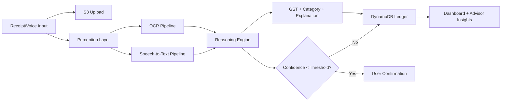

# FinGuru - Multilingual Agentic AI Tax Assistant

A cloud-native AI system that converts receipts and voice inputs into structured financial insights, CA-style advice, and compliance reminders.

Clean, confident, no fluff.

## 2) Problem Statement

Small businesses manage finances through scattered receipts, photos, and voice notes.
Even when data exists, they still lack clarity on expenses, GST impact, and compliance requirements.

This leads to:
- Misclassified expenses
- Missed deadlines
- Avoidable penalties
- Poor financial decisions

The core challenge is not data collection. It is understanding and guidance.

## 3) Solution Overview

FinGuru organizes unstructured financial data and transforms it into clear, actionable insights.

It:
- Extracts data from receipts and voice inputs
- Classifies expenses and estimates GST impact
- Generates CA-style explanations and guidance
- Flags entries that need confirmation
- Supports Hinglish and Hindi voice inputs in a unified reasoning pipeline

## 4) System Architecture

FinGuru follows a layered architecture:

1. Input Layer
- Receipt images and voice/audio inputs

2. Storage Layer
- Amazon S3 for uploaded files (audio and asset storage)

3. Perception Layer
- Receipt OCR: Vision model pipeline (current implementation)
- Speech-to-text: Whisper API pipeline (current implementation)
- AWS-native equivalents for this layer: Amazon Textract + Amazon Transcribe

4. Reasoning Layer (Agentic AI)
- Expense classification
- GST inference
- Confidence scoring
- Advice and explanation generation
- Human-in-the-loop trigger for low-confidence outputs

5. Data Layer
- Amazon DynamoDB for structured ledger records and summaries

6. Language Layer
- Current: Hinglish/Hindi input with English-centered reasoning output pipeline
- Planned AWS-native extension: Amazon Translate for full bidirectional multilingual translation

## 5) Agentic AI Workflow

FinGuru uses a step-based reasoning workflow that mimics a Chartered Accountant:

1. Understand the expense context
2. Classify category from accounting specification
3. Determine GST applicability and rate
4. Mark confidence and flag uncertain items
5. Compare against historical records (via ledger views)
6. Generate advice and action suggestions
7. Provide explanation trace for auditability

## 6) Multilingual Support

Current multilingual flow:

User Input (Hindi/Hinglish voice or text) -> Transcription/Parsing -> AI Reasoning -> Structured output + explanation

Extended pipeline (roadmap):

User Input -> Translate to English -> AI Reasoning -> Translate back

This keeps reasoning consistent while enabling broader language accessibility.

## 7) Tech Stack

- FastAPI (Python) - backend APIs
- React + TypeScript + Vite - frontend
- AWS S3 - file/object storage
- AWS DynamoDB - structured ledger storage
- OpenRouter/OpenAI LLM - reasoning and explanations
- Whisper API - speech-to-text
- Vision model API - receipt OCR extraction
- Render/Vercel deployment configs included

Notes on correctness:
- The current codebase is API-server based (FastAPI), not AWS Lambda-first.
- OCR/STT currently run through model APIs; Textract/Transcribe are natural AWS-native swaps.

## 8) Cost Optimization

- All major operations are user-triggered
- No always-on batch or background processing loops
- Minimal API calls per workflow step
- Graceful fallback path in reasoning service
- Practical free-tier-conscious development setup

## 9) Features

- Receipt to structured expense conversion
- Voice-based expense input
- GST-aware categorization and calculations
- CA-style explanations per entry
- Confidence-based confirmation flow
- Ledger summaries and category analytics
- Agentic reasoning workflow

## 10) Demo / Screenshots

Add these assets for stronger credibility:

- UI screenshots (Dashboard, Receipt Upload, Voice Upload, Ledger)
- Workflow diagram image


```markdown


```

### Workflow Diagram (Mermaid)



## 11) How to Run

1. Clone the repository
2. Backend setup
- cd backend
- pip install -r requirements.txt
- configure .env with AWS and API keys
- run: uvicorn main:app --reload --port 8000
3. Frontend setup
- cd frontend
- npm install
- npm run dev
4. Open frontend in browser and start uploading receipts/voice

## 12) Future Scope

- Full AWS-native perception pipeline (Textract/Transcribe/Translate)
- Advanced compliance tracking and reminders
- Multi-agent orchestration for specialized accounting tasks
- Financial forecasting and anomaly detection
- Integration with accounting platforms and ERP tools

## API Surface (Current)

- POST /api/auth/register
- POST /api/auth/login
- POST /api/receipts/upload
- POST /api/receipts/confirm
- POST /api/voice/upload
- POST /api/voice/upload-text
- POST /api/voice/confirm
- GET /api/ledger/entries
- GET /api/ledger/summary
- GET /api/advisor/insights

